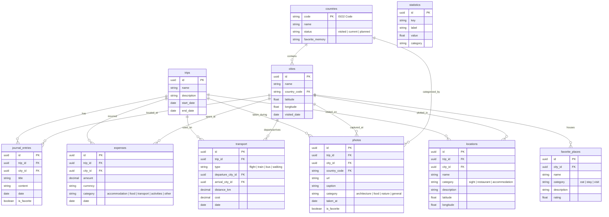

# EuroVenture: Interactive Europe Study & Travel Portfolio

EuroVenture is a production-ready, highly interactive digital travel portfolio documenting an exchange semester and journeys across Europe. Rather than a static blog, the application combines immersive storytelling, custom coordinates maps, photography archives, and real-time travel expenditure analytics.

The frontend is built using **React 19**, **Vite**, **TypeScript**, and **Tailwind CSS**. It is fully decoupled from the backend database (**Supabase**), allowing new trips, coordinates, journal entries, and photo uploads to be managed dynamically through a custom administrative CMS panel without modifying client-side code.

---

## 🚀 Key Features

*   **Expedition Timeline (`/journey`)**: A chronological narrative timeline of trips. Cards expand to reveal detailed journals, budget analytics, photo logs, transit legs, and local pins.
*   **Immersive Map (`/explore`)**: An interactive leaflet map of Europe that visually highlights visited, current, and planned countries based on database status. Features custom icon categories for sights, restaurants, and accommodation.
*   **Interactive Replay System**: A chronological animation slider on the map allowing users to "playback" the travel sequence step-by-step from start to finish.
*   **Media Archives (`/gallery`)**: A premium masonry photography gallery with category filters, dynamic lightboxes, and a mini Leaflet locator map showing coordinates for each shot.
*   **Expenditure Analytics (`/analytics`)**: Recharts-powered graphs analyzing total expenses, cost-efficiency per day, budget categorization, transit distance divisions, and carbon footprint offsets saved by riding railways.
*   **CMS Administration Panel (`/admin`)**: A secure, fully featured CRUD panel allowing the owner to add, edit, or delete items in all 10 relational tables (Trips, Cities, Countries, Journals, Photos, Expenses, Transport, Locations, Statistics, and Favorites).
*   **Hybrid Preview Mode**: If Supabase credentials are not configured, the app automatically switches to a fully functional client-side Mock Database, allowing offline previews and sandbox evaluations.

---

## 🛠 Technology Stack

*   **Framework**: React 19 (Hooks, Contexts, Suspense, Lazy Loading)
*   **Bundler**: Vite 8 & TypeScript (Code-Splitting, Dynamic Routing)
*   **Styling**: Tailwind CSS (Harmonious material HSL system, Glassmorphism, animations)
*   **State & Queries**: TanStack Query v5 (Auto caching, optimistic mutations)
*   **Maps**: React Leaflet & OpenStreetMap (Custom bounding-box overlays, color-coded pins)
*   **Charts**: Recharts (Pie & Bar charts with animated transitions)
*   **Database & Auth**: Supabase (PostgreSQL, Supabase Auth, Supabase Storage buckets)

---

## 💻 Local Quickstart

### 1. Clone the repository and install dependencies
```bash
npm install --legacy-peer-deps
```

### 2. Configure Environment Variables
Copy `.env.example` to a new file named `.env` in the root directory:
```bash
cp .env.example .env
```
Open `.env` and enter your Supabase connection parameters (found in your Supabase Project Settings -> API):
```env
VITE_SUPABASE_URL=https://your-project-id.supabase.co
VITE_SUPABASE_ANON_KEY=your-supabase-anonymous-public-key
```
*Note: If these variables are left empty or omitted, EuroVenture automatically initiates in **Mock Preview Mode** with pre-populated dummy travel data. No database config is required for local evaluation.*

### 3. Launch Development Server
```bash
npm run dev
```
Open [http://localhost:5173](http://localhost:5173) in your web browser.

---

## 🗄 Database Schema Design

If you are using live Supabase integration, run the SQL script located in [supabase_schema.sql](file:///d:/STEP%20website/supabase_schema.sql) in your Supabase SQL Editor. This script creates the following schema:



---

## 🔒 CMS & Administration Panel

To add new content or edit existing trips, navigate to the **`/admin`** route.

### 🔐 Authentication Options
1.  **Live Supabase Auth**: When Supabase credentials are configured, sign in using credentials created via the Supabase Dashboard User Table.
2.  **Mock Preview Credentials**: When running in Mock Mode, sign in using the following default developer credentials:
    *   **Email**: `admin@euroventure.com`
    *   **Password**: `password123`

### 📸 Dynamic Photo Storage
The photo administration panel includes a file upload area.
*   In **Live Mode**, files are uploaded directly to the Supabase Storage Bucket named `photos` using `supabase.storage.from('photos').upload()`, returning public URLs automatically.
*   In **Mock Mode**, files are encoded into Base64 URLs and temporarily stored in the client-side mock database, preserving functionality.

---

## 🚢 GitHub Pages SPA Deployment

The site is configured to deploy automatically via GitHub Actions.

### SPA Router Routing Fix
Standard React Single Page Applications hosted on GitHub Pages trigger 404 errors if a user refreshes the page on a subroute (e.g. `/explore`). 
To solve this, EuroVenture includes a custom `postbuild` script (`scripts/postbuild.js`) that duplicates `index.html` as `404.html` in the build directory (`dist/`). When GitHub Pages receives a direct request for a subroute, it serves the `404.html` fallback, which correctly boots React Router to render the requested page.

### Automatic Deployments
Every push to the `main` or `master` branch triggers the GitHub Workflow configured in `.github/workflows/deploy.yml`.

#### Adding Supabase Secrets to GitHub:
To connect your deployed site to your Supabase instance:
1.  Navigate to your GitHub Repository -> **Settings** -> **Secrets and variables** -> **Actions**.
2.  Add a **New repository secret**:
    *   `VITE_SUPABASE_URL`: Enter your Supabase Project URL.
    *   `VITE_SUPABASE_ANON_KEY`: Enter your Supabase Anon Key.
3.  Future pushes will build and compile the application with these credentials automatically.
